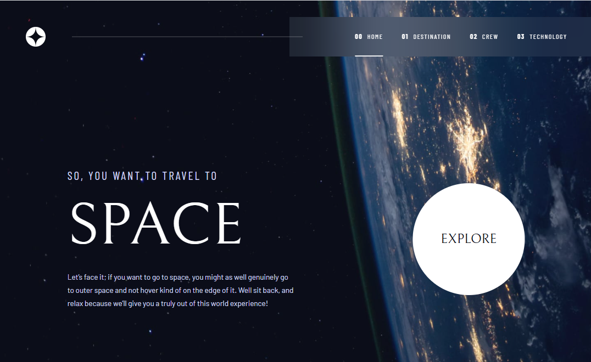

# Space Tourism Website

A modern, responsive space tourism website built as part of a Frontend Mentor challenge. This multi-page website showcases space destinations, crew members, and cutting-edge space technology with a sleek, futuristic design.


## 📸 Screenshots

### Home Page



### Destinations


### Crew


### Technology


## 🚀 Overview

This project is a solution to the [Space Tourism Website challenge on Frontend Mentor](https://www.frontendmentor.io/challenges/space-tourism-multipage-website-gRWj1URZ3). The challenge involves building a multi-page space tourism website that matches the provided Figma design.

## 🛠 Technologies Used

- **React 19.1.0** - Frontend framework
- **React Router DOM 7.6.3** - Client-side routing
- **Vite 7.0.0** - Build tool and development server
- **Sass 1.89.2** - CSS preprocessor for enhanced styling

## 📋 Prerequisites

Before running this project, make sure you have the following installed:

- **Node.js** (version 16 or higher)
- **npm** or **yarn** package manager

## 🚀 Getting Started

1. **Clone the repository**

   ```bash
   git clone https://github.com/Marwan878/Space-Tourism-Figma-Challenge
   cd space-tourism-website-main
   ```

2. **Install dependencies**

   ```bash
   npm install
   ```

3. **Start the development server**

   ```bash
   npm run dev
   ```

4. **Open your browser**
   Navigate to `http://localhost:5173` to view the website

## 🏗 Available Scripts

- `npm run dev` - Start the development server
- `npm run build` - Build the project for production
- `npm run preview` - Preview the production build locally
- `npm run lint` - Run ESLint to check for code issues

## 📁 Project Structure

```
src/
├── components/         # UI components
├── pages/             # Main page components
│   ├── Home.jsx       # Landing page
│   ├── Destination.jsx # Space destinations
│   ├── Crew.jsx       # Crew members
│   └── Technology.jsx # Space technology
├── Layout/            # Layout components
├── styles/            # Global styles and Sass files
├── constants/         # Application constants and data
├── App.jsx           # Main application component
└── main.jsx          # Application entry point

public/
├── destination/       # Destination images
├── crew/             # Crew member images
├── home/             # Home page assets
├── shared/           # Shared assets (logos, icons)
├── technology/       # Technology images
└── screenshots/      # Project screenshots
```

## 🎨 Design

The design for this project was provided by Frontend Mentor and includes:

- **Typography**: Barlow Condensed, Bellefair, and Barlow font families
- **Color Scheme**: Space-themed color palette with dark backgrounds and contrasting text
- **Layout**: Modern, clean layout optimized for multiple screen sizes
- **Interactive Elements**: Hover effects and smooth transitions

## 🤝 Contributing

If you'd like to contribute to this project:

1. Fork the repository
2. Create a feature branch (`git checkout -b feature/amazing-feature`)
3. Commit your changes (`git commit -m 'Add some amazing feature'`)
4. Push to the branch (`git push origin feature/amazing-feature`)
5. Open a Pull Request

## ✅ Acknowledgments

- [Frontend Mentor](https://www.frontendmentor.io/) for providing the challenge and design files
- Design inspiration from modern space industry websites
- The React and Vite communities for excellent documentation and tools

---

**Live Demo**: https://space-tourism-figma-challenge.vercel.app/

**Frontend Mentor**: https://www.frontendmentor.io/profile/Marwan878

**Figma File**: https://www.figma.com/design/ggQoZ6XGDk9BhSRxuMYrr4/space-tourism-website?m=auto&t=RwwXmpz026u4AZ5Y-1
